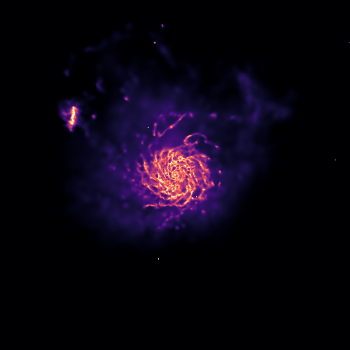
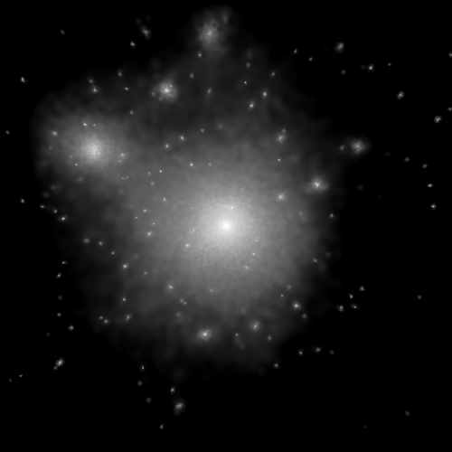
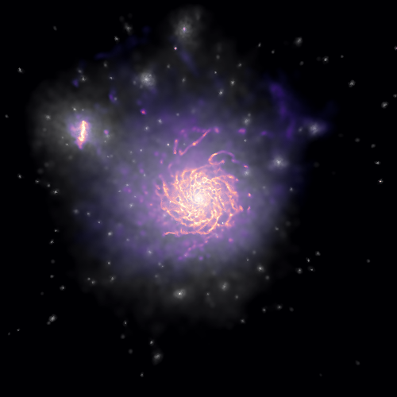
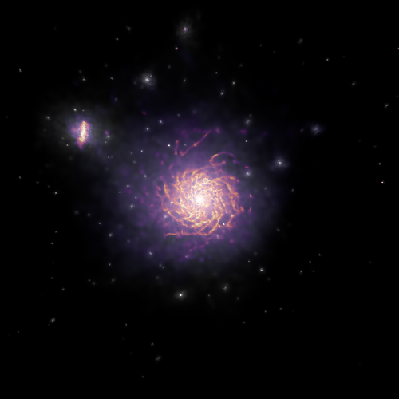
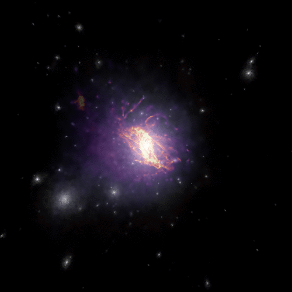

# Combining multiple images

Sometimes users might need to "blend" two or more images. This might be required for showing, for example, the projected stellar density on top of the projected gas density field, or the projected gas density on top of the dark matter distribution.

There are many ways of combining images, and the final result will depend strongly on the adopted algorithm. Py-SPHViewer currently includes only two blending algorithms called "Screen" and "Overlay". These are included as part of the ```Blend``` tools. These blending modes were borrowed from [GIMP](https://docs.gimp.org/en/gimp-concepts-layer-modes.html).

We shall use the individual images shown below, created using the [QuickView](tutorial_quickview.html) tool;

Gas distribution
<p align="center">
   
</p>

Dark matter distribution
<p align="center">
   
</p>


# Screen blending mode


According the the **Screen** mode, If $$ I_{1} $$ and $$ I_{2} $$ are RGB images, then the resulting image $I_{f}$ is:

$$ I_{f} = 255 - \displaystyle\frac{(255 - I_1) \times (255 - I_{2})}{255} $$.

This blending mode tends to preserve individual colours relatively well. As explained [here](https://docs.gimp.org/en/gimp-concepts-layer-modes.html), the resulting image is usually brighter. Black regions do not change, and a white regions become fully white in the resulting image. Darker colours in the image appear to be more transparent. The resulting image is independent of the order in which the two images are blended.

We can blend the images using **screen** as follows:

```python
from sphviewer.tools import Blend
blend = Blend.Blend(rgb_dm,rgb_gas)
output = blend.Screen()
```

which produces:

<p align="center">
   
</p>


# Overlay blending mode

According the the **Overlay** mode, If $$I_{1}$$ and $$I_{2}$$ are RGB images, then the resulting image $I_{f}$ is:

$$ I_{f} = \displaystyle\frac{I_{1}}{255} \times \left [ I_{1} + \displaystyle\frac{2I_{2}}{255} \times \left ( 255 - I_{1} \right ) \right ] $$

This blending mode depends on the order in which images are blended. To apply this method we simply call the ```Overlay``` method:

```python
from sphviewer.tools import Blend
blend = Blend.Blend(rgb_dm,rgb_gas)
output = blend.Overlay()
```

which produces:

<p align="center">
   
</p>

For this particular example, the overlay blending mode seems to return the best image.


Finally, blending images may produce very nice results when applied to videos: For example:

```python
import matplotlib as ml
from sphviewer.tools import QuickView, Blend

for p in range(360):    
    cmap_dm = matplotlib.cm.Greys_r
    cmap_gas = matplotlib.cm.magma

    qv_gas   = QuickView(pgas, mass=np.ones(len(pgas)), plot=False, r=200, p=p, t=0)
    qv_drk   = QuickView(pdrk, hsml=hsml, mass=np.ones(len(pdrk)), plot=False,  r=200, p=p, t=0)
    img_gas  = qv_gas.get_image()
    img_drk  = qv_drk.get_image()

    rgb_dm  = ml.Greys_r(get_normalized_image(img_drk, 0, 2.5))
    rgb_gas = ml.magma(get_normalized_image(img_gas, 0.3, 1.7))

    blend = Blend.Blend(rgb_dm, rgb_gas)
    rgb_output = blend.Overlay()

    plt.imsave('snap_%03d.png'%p, rgb_output)
```

Previous examples creates two different images using ```QuickView```, one for the gas, and for the dark matter. The loop is done over the angle $$\phi$$ (```p```), between 0 and 360. Individual images are then converted to RGB images through matplotlib.colors.LinearSegmentedColormap. ```get_normalized_image``` is a very simple function that normalizes the image so that we can set the minimum/maximum value below/above which the image saturates:

```python
def get_normalized_image(image, vmin=None, vmax=None):
    if(vmin == None):
        vmin = np.min(image)
    if(vmax == None):
        vmax = np.max(image)

    image = np.clip(image, vmin, vmax)
    image = (image-vmin)/(vmax-vmin)

    return image
```

The resulting video, after concatenating individual images, is shown below:

<p align="center">
   
</p>
