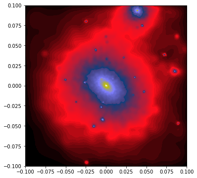
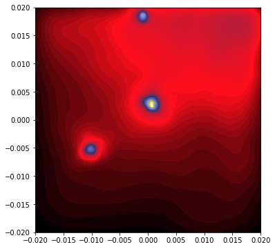
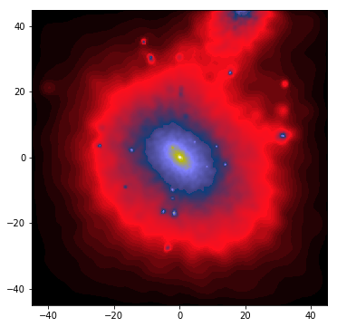
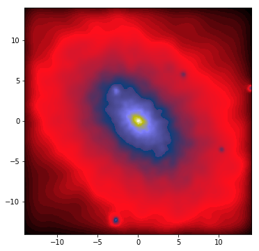
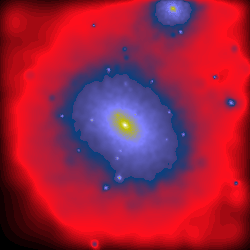
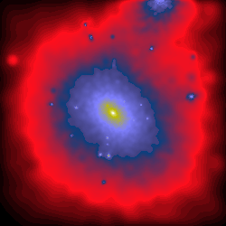

# Scene projections

Images are constructed by projecting a Scene onto a plane and there are different of ways of doing so.

Py-SPHViewer includes two types of projections, namely, parallel and perspective. The difference between these two projections is the location of the observer with respect to the Scene.

Parallel projection places the observer at the infinity, whereas the perspective projection places the observer at a finite distance from the Scene, thus introducing "perspective".

We will show below a worked example using these two projections, and hopefully, this will highlight the difference between them:

Please, download [**this file**](https://github.com/alejandrobll/py-sphviewer/blob/master/examples/dm_halo.h5py?raw=true) before continuing with the tutorial:

## Parallel projection

As explained in the [QuickView](tutorial_quickview.html) tutorial, we can generate an image of the dark matter halo as follows:

```python
import matplotlib.pyplot as plt
import h5py
from sphviewer.tools import QuickView

qv_parallel = QuickView(pos.T, r='infinity', plot=False,
                        x=0,y=0,z=0, extent=[-0.1,0.1,-0.1,0.1])

hsml = qv_parallel.get_hsml()

fig = plt.figure(1, figsize=(6,6))
imshow(qv_parallel.get_image(), extent=qv_parallel.get_extent(),
       cmap='gist_stern', origin='lower')
plt.show()
```

which produces the following image:

<p align="center">
   
</p>

Note that we have introduced a number of new features compared to the simple example shown when reviewing [QuickView](tutorial_quickview.html). As explained in that tutorial, the argument ```r=’infinity’``` indicates that the camera is looking at the scene from the infinity, so that the scene has to be rendered using a parallel projection.

The arguments ```x=0, y=0, z=0``` indicate that the camera should point to that point of the space (which in this example corresponds to the centre of the dark matter halo), and the ```extent=[-0.1,0.1,-0.1,0.1]``` argument tells Py-SPHViewer that we want to render 0.1 Mpc to the left and right of ```x=0```, and 0.1 Mpc above and below of ```y=0```. As you see, the ```extent``` argument is given as a list of ```[x-xmin, xmax-x, y-ymin, ymax-y]```.

Note that ```qv.get_extent()``` returns the actual physical extent of the image. If not used, matplotlib will just print the number of pixels of the image.

Before considering a different projection, let's change previous parameters slightly so that it becomes clear what is their impact on the image. For example, the image reveals that there is a small subhalo located at ```x=0.005``` and ```y=-0.045```. To point the camera to this object, and zoom in, we use the code below:

```python
qv_subhalo = QuickView(pos.T, hsml=hsml, r='infinity', plot=False,
                       x=-0.005,y=-0.045,z=0, extent=[-0.02,0.02,-0.02,0.02])

fig = plt.figure(1, figsize=(6,6))
imshow(qv_subhalo.get_image(), extent=qv_subhalo.get_extent(),
       cmap='gist_stern', origin='lower')
plt.show()
```

<p align="center">
   
</p>

Note that we have introduced a new argument ```hsml```. This argument contains the SPH smoothing length of the particles. If the argument is not given, Py-SPHViewer will calculate it in parallel. However, this is an expensive task that should be avoided, unless necessary. Smoothing lengths were calculated in our first example, and stored in the ```hsml``` array using ```qv.get_hsml()``` method, so that we do not need to calculate them one more time.

Let's try now the perspective projection.

## Perspective projection

If the observer is at a finite distance from the Scene, then objects that are closer to the camera display a greater angular diameter than those that are further away. This effect is calculated by Py-SPHViewer when the camera is placed at a finite distance. Changing ```r='infinite'``` from the previous example by ```r=0.1``` will just tell the code that we do not want to use a parallel projection, but to place the camera at a distance of 0.1 Mpc from the halo:

```python
import matplotlib.pyplot as plt
import h5py
from sphviewer.tools import QuickView

qv_perspective = QuickView(pos.T, r=0.1, plot=False,
                           x=0,y=0,z=0, extent=[-0.1,0.1,-0.1,0.1])

fig = plt.figure(1, figsize=(6,6))
imshow(qv_perspective.get_image(), extent=qv_perspective.get_extent(),
       cmap='gist_stern', origin='lower')
plt.show()
```

which produces the following image:

<p align="center">
   
</p>

Although the image does not look dramatically different compared to that of the parallel projection, they are indeed very different. Note, for example, that the limits of the image go from -45 to +45 in either direction. These numbers now represent the angular size of the Scene. By default, the field of view (FoV) of the camera is 90 degrees (this can be changed by specifying the ```zoom``` variable).

As pointed out above, the images generated with both, the parallel and the perspective projection, look very similar. This is not unexpected, as we chose the distance of the camera ```r=0.1``` on purpose so that the angle subtended by 0.2 Mpc is 90 degrees. In general, the relation between the distance of the camera, $$r$$, its magnification $$M$$ (this is the ``zoom`` variable), and the linear length of the Scene, $$l$$ is:

$$ r = \displaystyle\frac{l * M}{2}$$.

We could have a closer look at the inner 0.05 Mpc of the halo by changing either $$r$$ or $$M$$. Changing $$r$$ would move the camera closer to the halo, but changing $$M$$ would leave the camera at its current position and change the FoV. Although both methods would produce an image of the same region of the halo, the former would prevent the particles along the line of sight to be rendered.

The relation between FoV and $M$ is given by:

$$\tan \left ( \displaystyle\frac{FoV}{2} \right ) = \displaystyle\frac{1}{M}$$


The previous equation indicates that in order to render the inner 0.05 Mpc of the halo, from a distance of 0.1 Mpc, we should use $$M=4$$ (i.e., $$FoV \sim 26^o$$):

```python
import matplotlib.pyplot as plt
import h5py
from sphviewer.tools import QuickView

qv_perspective = QuickView(pos.T, r=0.1, plot=False,
                           x=0,y=0,z=0, extent=[-0.1,0.1,-0.1,0.1], zoom=4)

fig = plt.figure(1, figsize=(6,6))
imshow(qv_perspective.get_image(), extent=qv_perspective.get_extent(),
       cmap='gist_stern', origin='lower')
plt.show()
```
<p align="center">
   
</p>

Finally, the left and right panels below show a rotation along the vertical axis with the parallel and perspective projections, respectively.

<p align="center">
   
   
</p>
