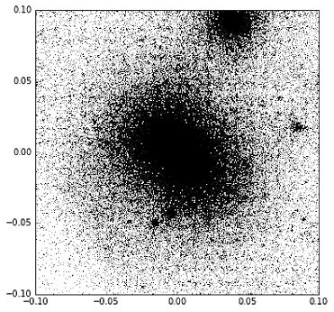
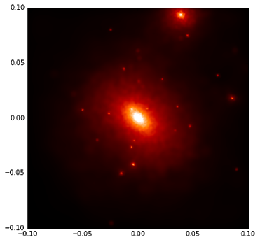

# Using QuickView in Py-SPHViewer

QuickView is the simplest way to produce an image with Py-SPHViewer. Here we use a simple example that illustrates its use.

# Looking at a dark matter halo with QuickView

In this example we will create an image of a dark matter halo extracted from a cosmological simulation. Before starting the tutorial please download [**this file**](https://github.com/alejandrobll/py-sphviewer/raw/master/examples/dm_halo.h5py).

We can read the content of the file using the [h5py](https://www.h5py.org/) library:

```python
import h5py

with h5py.File('dm_halo.h5py','r') as f:
    pos = f['Coordinates'].value
```
The coordinates of the dark matter particles are expressed in Mpc/h, and they trace the density field of a collapsed dark matter halo extracted from a cosmological simulation. Our goal will be to visualise the projected density field.

The image below shows the *xy* projection of the distribution of particles:

<p align="center">
   
</p>


The projected density field can be calculated (and visualised) using QuickView:

```python
from sphviewer.tools import QuickView
qv = QuickView(pos.T, r='infinity', plot=False)
qv.imshow()
```

<p align="center">
   
</p>


Note that we pass pos.T as argument because our array was ```pos[Npart,3]```, whereas PySPHViewer expects an array of shape ```pos[3,Npart]```. The argument ```r=’infinity’``` indicates that the camera is looking at the scene from the infinity, so that the scene has to be rendered using a [parallel (or orthographic)](https://en.wikipedia.org/wiki/Parallel_projection) projection.

QuickView retrieves the active axis and places the image on it; ```plot=False``` prevents this from happening. QuickView objects have an associated ```imshow``` method to show the final image. Valid ```*kwargs``` are identical to those accepted by matplotlib.pyplot.imshow. For example, we can change the ```colormap``` and ```vmin``` as follows:

```python
qv.imshow(cmap="gist_stern", vmax=2)
```
<p align="center">
   
</p>

There are also methods to retrieve the image generated by QuickView:

```python
img = qv.get_image()
extent = qv.get_extent()
fig = plt.figure(1, figsize=(7,7))
plt.imshow(img, extent=extent, cmap='gist_stern')
```

<p align="center">
   
</p>
