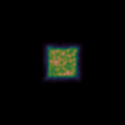
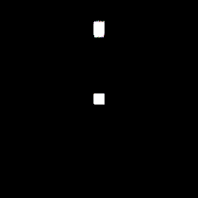

# Defining a Smooth Camera with Py-SPHViewer

Py-SPHViewer enables users to define custom smooth camera trajectories. The tool that makes this possible is called ```camera_tools```, and it was originally designed by [Adrien Thob](http://www.astro.ljmu.ac.uk/~astathob/), who was inspired in Adobe Surge Target.

In this tutorial we show how to use this wonderful tool to define a custom trajectory.

## Defining the Universe

For the example of the tutorial we will define an Universe filled with two cubes, located at $$(x_1,y_1,z_1) = (0.5,1.5,0.5)$$ and $$(x_2,y_2,z_2) = (0.5,-5.5,0.5)$$, respectively:

```python
import matplotlib.pyplot as plt
import h5py
from sphviewer.tools import camera_tools

n1 = 10000

cube1 = np.random.rand(3,n1)
cube1[:,1] -= 6
cube2 = np.random.rand(3,n1)
cube2[:,1] += 1
cubes = np.concatenate((cube1,cube2),axis=0)
mass  = np.ones(n1+n1)
```

## Instantiating the Particles, Scene and Camera objects.

Rather than using [QuickView](tutorial_quickview.html) for rendering the Scene, we will construct the image more efficiently by using internal functions of Py-SPHViewer.

In particular, we will instantiated the Particles and the Scene class. The Camera will be instantiated automatically when instantiating the Scene:

```python
S = sph.Scene(P)
P = sph.Particles(cubes, mass)
```

In this way, the Camera parameters will be updated using the ```Scene.update_camera()``` method.

## Defining the camera trajectory

Before defining the trajectory of the camera, we should think what we would like to see, and when we would like to see it. For example, suppose we want to make a video consisting of 1680 frames, given the following constraints:

* the camera starts by looking at the first cube in snapshot 0, but starts moving to reach the second cube in snapshot 180.
* the camera is still at the second cube until snapshot 750, after which it starts moving gradually towards the first cube.
* the camera reaches the first cube in snapshot 930, and remains there until snapshot 1500, after which the camera starts moving towards the second cube, which is reached at snapshot 1680.

Previous sequence defines the trajectory (or behaviour) of the camera using **"anchors"**. ``camera_tools`` uses this anchors to construct a smooth trajectory interpolated between the them. This is done as follows:

```python
cm_1 = [0.5,1.5,0.5]
cm_2 = [0.5,-5.5,0.5]

targets = [cm_1, cm_2]

anchors = {}
anchors['sim_times'] = [0.0, 1.0, 'pass', 3.0, 'same','same','same']
anchors['id_frames'] =  [0,180,750,840,930,1500,1680]
anchors['r']         =  [2,'same','same','same','same','same','same']
anchors['id_targets']=  [0,1,'same','pass',0,'same',1]
anchors['t']         = [0,'same','same','same','same','same',0]
anchors['p']         = [0,'same','same','same','same','same','same']
anchors['zoom']      = [1.,'same','same','same','same','same','same']
anchors['extent']    = [10, 'same','same','same','same','same',30]

data = camera_tools.get_camera_trajectory(targets,anchors)

h = 0
for i in data:
    i['xsize'] = 250
    i['ysize'] = 250
    i['roll'] = 0
    S = sph.Scene(P)
    S.update_camera(**i)
    R = sph.Render(S)
    img = R.get_image()
    R.set_logscale()
    plt.imsave('img/image_'+str('%04d.png'%h), img, vmin=0, vmax=6, cmap='cubehelix')
    h += 1
```

The 7 anchors, defined by the ```anchors``` dictionary, contain most of the relevant parameters of the camera, such as ```zoom, extent, r, t, p```. There are other parameters such as ```id_targets```, which defines the index of individual targets, ```id_frames```, which defines the current snapshot of the anchor, and ```sim_times```, useful for defining the trajectory of the camera in simulations that evolve in time. These anchors are then passed to ```camera_tools.get_camera_trajectory```, which returns a list of the parameters of the camera that should be used to evolve the camera at each snapshot.

Note also that we use special arguments called ```same``` and ```pass```. These are defining the behaviour of the camera at each anchor. ```same``` means that the parameter of the current anchor must be identical to that of the previous one. ```pass```, on the other hand, indicates that the value of the current anchor has to be interpolated between the values from the previous and the next anchors. The result of the previous code is shown below:

<p align="center">
   
</p>


In order to make previous video slightly impressive, we may vary more parameters at the same time. For example, we could rotate the camera along either the vertical or horizontal axis, change its distance to the cubes, etc. Consider the following anchors:
```python
anchors = {}
anchors['sim_times'] = [0.0, 1.0, 'pass', 3.0, 'same','same','same']
anchors['id_frames'] =  np.array([0,180,750,840,930,1500,1680])/4
anchors['id_targets']=  [0,1,'same','pass',0,'same',1]
anchors['extent']    = [10, 'same','same','same','same','same',30]

anchors['r']         =  [10,2,'same',4,2,'same',10]
anchors['t']         = [0,'pass','pass',45,'pass','pass',0]
anchors['p']         = [0,'pass','pass','pass','pass','pass',900]
anchors['extent']    = [10, 'pass','pass','pass','pass','pass',30]
```

which produce the result shown below:

<p align="center">
   
</p>

Hopefully, these two examples gave you a quick overview of the power of ```camera_tools```. There are infinite ways of combining the parameters of the camera to obtain impressive videos. The following video was generated using ```camera_tools```:

<p align="center">
   <a href="https://www.youtube.com/watch?annotation_id=annotation_692472089&feature=iv&src_vid=vqGYURAgYUY&v=4ZIgVbNlDU4" target="_blank"> </a>
</p>
