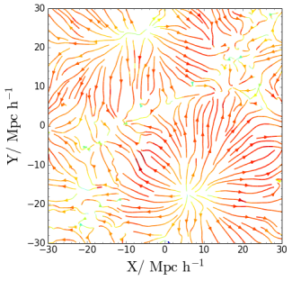
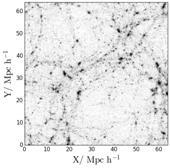
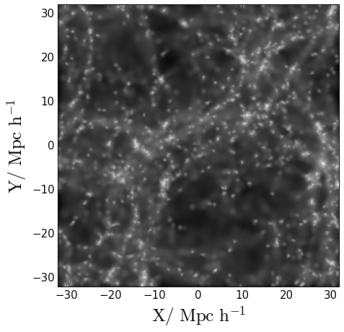
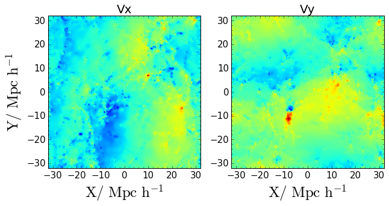

# Streamlines of N-body simulations

Have you ever wondered how to get the [streamlines](https://en.wikipedia.org/wiki/Streamlines,_streaklines,_and_pathlines) of the velocity field of a N-body simulation?

Streamlines are an extraordinary tool to get insight on what is going on in a simulation by inspecting one single snapshot. They are also extremely useful in many applications that are outside the scope of this tutorial.

The Figure below shows the streamlines of the velocity field of a cosmological N-body simulation. Although the underlying density field is not shown, we can infer its presence by looking at the flux lines. Indeed, we can infer the presence of a “void” at (x,y) = (10,-20) because the flux lines point outward. We can also infer the location of filaments by looking at the intersection of opposing lines.

<p align="center">
   
</p>


Doing streamlines plots is relatively straightforward once we have the velocity field calculated on a regular grid. However, for N-body simulations (or hydrodynamical SPH simulations) this information is not usually available. Here is where Py-SPHViewer can give us a hand.

With Py-SPHViewer we can calculate the instantaneous (and continuous) mean velocity field, which can then be passed to matplotlib to construct the streamlines.

We give below the recipe to get incredible results in only a few steps:

# Getting the data for this example and drawing the streamlines

In this example we shall use an output of a low-resolution N-Body cosmological simulation ran with [Gadget-2](https://wwwmpa.mpa-garching.mpg.de/gadget/).

The initial conditions were created using the [MUSIC](https://www-n.oca.eu/ohahn/MUSIC/). Please, download the [simulated data]( https://github.com/alejandrobll/py-sphviewer/blob/master/examples/darkmatter_box.h5py?raw=true) before continuing with the tutorial.

The Figure below shows a scatter plot of the data contained in the simulation output:

<p align="center">
   
</p>

We could obtain the local velocity field of the box by considering different slices individually, or we could obtain the mean projected velocity field by projecting the full box. We shall consider the latter. In particular, we will consider the density-weighted average, so that the first relevant quantity that is needed is the projected density field of the entire box, which can be calculated using [QuickView](/content/tutorial_quickview.html):

```python
import h5py
from sphviewer.tools import QuickView
#Read the file
with f as h5py.File('darkmatter_box.h5py', 'r'):
  pos = snap['PartType1/Coordinates'].value
  vel = snap['PartType1/Velocities'].value
  hsml = snap['PartType1/SmoothingLength'].value

#Calculate the density field
qv = QuickView(pos, hsml=hsml, r='infinity', x=32, y=32, z=32,
               plot=False, extent=[-32,32,-32,32], logscale=False)
density_field = qv.get_image()
extent = qv.get_extent()
```

The Figure below shows the resulting density field:

<p align="center">
   
</p>

 We need to repeat the procedure but for the *x* and *y* components of the velocity field:

 ```python
 vfield = []
 for i in xrange(2):
     qv = QuickView(pos, vel[:,i], hsml=hsml, r='infinity', x=32, y=32, z=32,plot=False,
     extent=[-32,32,-32,32], logscale=False)
     vfield.append(qv.get_image()/density_field)
 ```

in which we have smoothed the velocity field (*x* and *y* components separately), and divided the resulting field by the density field, which effectively produces a density-weighted average. The resulting fields are shown in the Figure below:

<p align="center">
   
</p>

We have now *all* the ingredients to let matplotlib do the magic:

```python
import matplotlib.pyplot as plt

fig = plt.figure(1, figsize=(7,7))
ax = fig.add_subplot(111)
X = np.linspace(extent[0], extent[1], 500)
Y = np.linspace(extent[2], extent[3], 500)
ax.imshow(np.log10(density_field), origin='lower', extent=extent, cmap='bone')
v = np.log10(np.sqrt(vfield[0]**2+vfield[1]**2))
color = v/np.max(v)
lw = 2*color
streams = ax.streamplot(X,Y,vfield[0], vfield[1], color=color,
                        density=1.5, cmap='jet', linewidth=lw, arrowsize=1)
ax.set_xlim(extent[0],extent[1])
ax.set_ylim(extent[2],extent[3])
ax.minorticks_on()
ax.set_xlabel(r'$\rm X / \ Mpc \ h^{-1}$', size=25)
ax.set_ylabel(r'$\rm Y / \ Mpc \ h^{-1}$', size=25)
plt.show()
```

<p align="center">
   
</p>

In previous figure, colours indicate the magnitude of the modulus of the velocity, from blue to red. The width of the lines are also a function of this quantity.

# Conclusions

Streamlines are straightforward to calculate for N-body simulations, provided the velocity field is known on a regular grid. The velocity field can be calculated using Py-SPHViewer and streamlines can be constructed with matplotlib.

Finally, Streamlines can also be animated to give a really deep insight on what is going on in the simulation. [Windy.com](https://www.windy.com) is a great example. This is part a different tutorial though.
