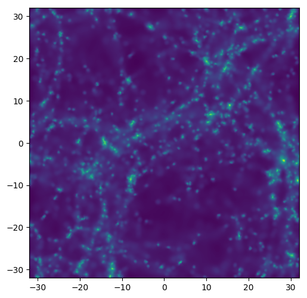

# NEWS: Py-SPHViewer successor

Although this is not publicly available yet, Py-SPHViewer has already got a successor. A GPU-powered real-time rendering tool for Python that greatly exceeds Py-SPHViewer's capabilities, both in terms of features and performance, including virtual reality and the ability to move the camera interactively using the keyboard and a Joystick. Check out the videos below:

<p align="center">
<iframe width="560" height="315" src="https://www.youtube.com/embed/c6-zhENhGdI" title="YouTube video player" frameborder="0" allow="accelerometer; autoplay; clipboard-write; encrypted-media; gyroscope; picture-in-picture" allowfullscreen></iframe> </p>

<p align="center">
<iframe width="560" height="315" src="https://www.youtube.com/embed/Q4yY3s4YQsw" title="YouTube video player" frameborder="0" allow="accelerometer; autoplay; clipboard-write; encrypted-media; gyroscope; picture-in-picture" allowfullscreen></iframe> </p>

Stay tunned for the latest updates on this. In the meantime, you are welcome to keep using py-sphviewer. For news, you can follow me on Twitter, where I will keep posting updates: [https://twitter.com/bllalejandro](https://twitter.com/bllalejandro)


---
title: HomePage
---

Py-SPHViewer is a parallel Python package to visualise and explore N-body + Hydrodynamics simulations using the Smoothed Particle Hydrodynamics (SPH) scheme. The code estimates an underlying scalar field (e.g., the density field) traced by a finite number of particles, and produces not only beautiful, but also scientifically useful images. In addition, Py-SPHViewer enables the user to explore simulated volumes using different projections.

Intensive calculations are all performed in parallel C code (which requires OpenMP) but, as any python package, it can be used interactively in a Python shell, [Ipython](http://ipython.org/) or [Ipython notebook](http://ipython.org/).

# Installation

The latest stable version of Py-SPHViewer is usually available in the Python Package Index (or [Pypi](https://pypi.python.org/pypi?:action=display&name=py-sphviewer&version=0.166) for short). This is the easiest method to get Py-SPHViewer running in your system and we encourage users to follow it:

    pip install py-sphviewer --user

The development version is available in GitHub. The following lines will clone, compile and install this version:

    git clone https://github.com/alejandrobll/py-sphviewer.git
    cd py-sphviewer
    python setup.py install


# Code Licence and citations

 Py-SPHViewer is under GNU GPL v3 licence, and was started by Alejandro Benitez-Llambay. This program is distributed in the hope that it will be useful, but without any warranty.

 Individuals or organizations that use Py-SPHViewer are encourage to cite the code.

 **If Py-SPHViewer has been significant for a research project that leads to a publication, please acknowledge by citing the project and using the following DOI as reference**:

 Alejandro Benitez-Llambay. (2015). py-sphviewer: Py-SPHViewer v1.0.0. Zenodo. 10.5281/zenodo.21703

 You may also use the the following BibTex:

     @misc{alejandro_benitez_llambay_2015_21703,
     author       = {Alejandro Benitez-Llambay},
     title        = {py-sphviewer: Py-SPHViewer v1.0.0},
     month        = jul,
     year         = 2015,
     doi          = {10.5281/zenodo.21703},
     url          = {http://dx.doi.org/10.5281/zenodo.21703}
     }

Some of the scientific papers that used Py-SPHViewer are listed [here]({{ site.baseurl }}/content/bibliography.html)

# Contributing

Users are encouraged to contribute with ideas, codes or by reporting (and fixing) bugs. Issues and bugs should be reported by creating issues in the main repository. If you would like to contribute with coding, for example, by adding a new feature, tool, or fixing a bug, you are welcome to do so by submitting a pull request.

If you plan to work on a major improvement or a new feature that requires a significant effort from your side, please contact me at alejandro.b.llambay@durham.ac.uk first, so that we can sort out the technical aspects prior starting the development.


# Getting started

To get started with Py-SPHViewer, please go and check the available examples in our Tutorials section. Perhaps the simpler examples that demonstrates the power of Py-SPHViewer viewer is the following:

Download [this hdf5 file](https://github.com/alejandrobll/py-sphviewer/raw/master/examples/darkmatter_box.h5py) and run:

```python
import h5py
from sphviewer.tools import QuickView

with h5py.File('darkmatter_box.h5py','r') as f:
    pdrk = f['PartType1/Coordinates'].value

QuickView(pdrk, r='infinity')
```

which produces the following image:

<p align="center">
   
</p>

The result is very impressive given the low-resolution of the simulated volume (only 32768 dark matter particles).

High-resolution cosmological simulations might result in extremely amusing results, such as the one shown in the next [video](https://www.youtube.com/watch?annotation_id=annotation_692472089&feature=iv&src_vid=vqGYURAgYUY&v=4ZIgVbNlDU4):

<p align="center">
<iframe width="640" height="480" src="https://www.youtube.com/embed/4ZIgVbNlDU4" frameborder="0" allowfullscreen></iframe>
</p>
